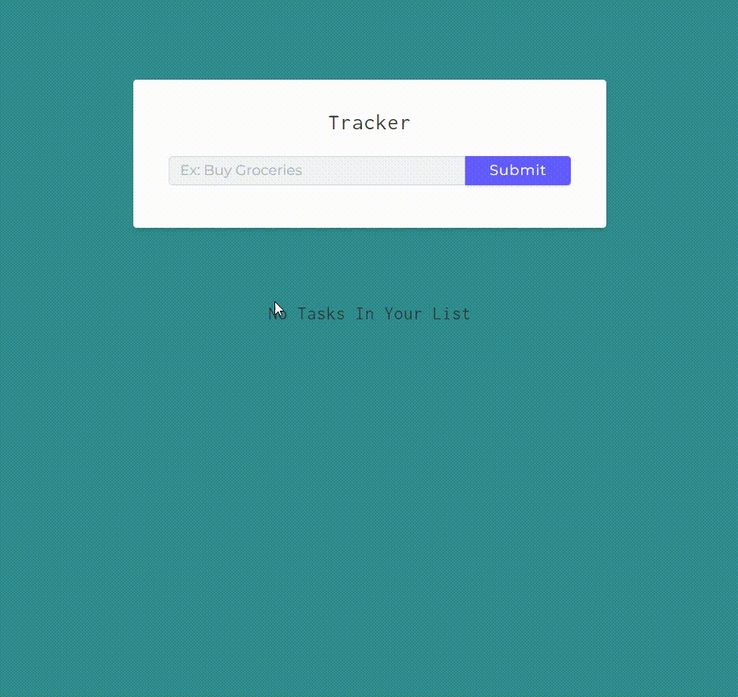

# Tracker using REST API

In the project directory, you can run: 
### `npm install` and then `npm start`

### Ability to perform CRUD operations

## Created using:
### `Node.js`
### `Express.js`
### `MongoDB/Mongoose`

## Testing using
### `Postman`

## This project is for learning purposes.
### Source from freeCodeCamp:
https://youtu.be/qwfE7fSVaZM
